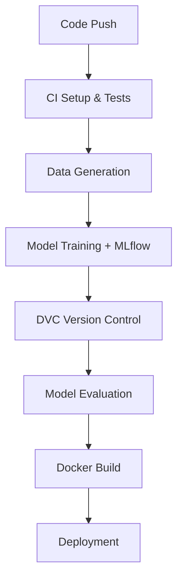

# 🚀 MLOps CI/CD Pipeline

> A production-ready MLOps pipeline featuring automated model training, versioning, and deployment with industry best practices.

## ✨ Features

<table>
<tr>
<td width="50%">

**🔄 Automation & CI/CD**
- GitHub Actions workflows
- Automated testing & validation
- Continuous model deployment

**📊 Experiment Tracking**
- MLflow integration
- Parameter & metric logging
- Model artifact management

</td>
<td width="50%">

**📦 Containerization**
- Docker packaging
- Reproducible environments
- Scalable deployment ready

**🔍 Data & Model Versioning**
- DVC integration
- Version control for datasets
- Model lineage tracking

</td>
</tr>
</table>

## 🏗️ Architecture



## 📁 Project Structure

```
mlops-pipeline/
├── app.py                      # Inference service
├── train_model.py              # Training script with MLflow
├── generate_data.py            # Synthetic data generator
├── Dockerfile                  # Container configuration
├── dvc.yaml                    # DVC pipeline definition
├── app_requirements.txt        # Dependencies
├── mlruns/                     # MLflow tracking artifacts
├── data/
│   └── raw_data.csv           # Dataset (DVC tracked)
├── models/                     # Model artifacts (DVC tracked)
└── .github/
    └── workflows/
        └── mlops_pipeline.yml  # CI/CD automation
```

## 🚀 Quick Start

### Prerequisites

- Python 3.9+
- Docker
- Git

### Installation

```bash
# Clone the repository
git clone https://github.com/yourname/mlops-pipeline.git
cd mlops-pipeline

# Create virtual environment
python -m venv venv
source venv/bin/activate  # On Windows: venv\Scripts\activate

# Install dependencies
pip install -r app_requirements.txt

# Initialize DVC
dvc init
```

### Running the Pipeline

```bash
# 1️⃣ Generate synthetic data
python generate_data.py

# 2️⃣ Train model with MLflow tracking
python train_model.py

# 3️⃣ Version control with DVC
dvc add data/raw_data.csv models/model.pkl
dvc push

# 4️⃣ Launch MLflow UI (optional)
mlflow ui
```

## 🔧 Configuration

### MLflow Setup

The pipeline uses MLflow for experiment tracking with local file storage:

```python
import mlflow
import mlflow.sklearn

# Log parameters and metrics
mlflow.log_param('solver', 'liblinear')
mlflow.log_metric('accuracy', 0.95)
mlflow.sklearn.log_model(model, "classifier")
```

**Local MLflow UI:** `http://localhost:5000`

### DVC Configuration

Version your data and models with DVC:

```bash
# Add remote storage (choose one)
dvc remote add -d storage s3://your-bucket/path
dvc remote add -d storage gs://your-bucket/path
dvc remote add -d storage azure://container/path

# Push versioned artifacts
dvc push
```

### Docker Deployment

Build and run the containerized model:

```bash
# Build image
docker build -t ml-inference-service .

# Run container
docker run -p 8080:8080 ml-inference-service
```

## 🔄 CI/CD Pipeline

The GitHub Actions workflow automatically:

| Stage | Description | Outputs |
|-------|-------------|---------|
| **🧪 Test** | Code quality checks & unit tests | Test reports |
| **📊 Data** | Generate and validate datasets | `data/raw_data.csv` |
| **🎯 Train** | Model training with MLflow logging | Model artifacts |
| **📦 Version** | DVC tracking and version control | `.dvc` files |
| **🐳 Package** | Docker image build | Container image |
| **🚀 Deploy** | Simulated deployment process | Deployment logs |

### Workflow Triggers

- ✅ Push to `main` branch
- ✅ Pull request creation
- ✅ Manual workflow dispatch

## 📊 Monitoring & Observability

### Logging Integration

```python
import logging
from datetime import datetime

# Configure structured logging
logging.basicConfig(
    level=logging.INFO,
    format='%(asctime)s - %(name)s - %(levelname)s - %(message)s'
)

logger = logging.getLogger(__name__)
logger.info(f"Model training completed: accuracy={accuracy:.4f}")
```

### Production Monitoring

Ready for integration with:

- **📊 Metrics**: Prometheus + Grafana
- **🔍 Tracing**: Jaeger, Zipkin
- **📈 ML Monitoring**: Evidently, WhyLabs
- **☁️ Cloud**: CloudWatch, Azure Monitor

## 🚀 Deployment Options

<details>
<summary><strong>🏢 Production Deployment</strong></summary>

### Kubernetes
```bash
kubectl apply -f k8s/deployment.yaml
```

### AWS SageMaker
```bash
aws sagemaker create-model --model-name ml-model
```

### Google Cloud AI Platform
```bash
gcloud ai-platform versions create v1 --model=ml-model
```

</details>

## 🛣️ Roadmap

- [ ] **Enhanced Monitoring**: Real-time model performance dashboards
- [ ] **A/B Testing**: Automated model comparison framework
- [ ] **Feature Store**: Centralized feature management
- [ ] **Auto-scaling**: Dynamic resource allocation
- [ ] **Multi-environment**: Dev/staging/prod pipeline stages

## 🤝 Contributing

We welcome contributions! Please see our [Contributing Guide](CONTRIBUTING.md) for details.

### Development Setup

```bash
# Install development dependencies
pip install -r requirements-dev.txt

# Run tests
pytest tests/

# Code formatting
black . && isort .

# Type checking
mypy src/
```

## 📄 License

This project is licensed under the MIT License - see the [LICENSE](LICENSE) file for details.

## 🙏 Acknowledgments

Built with these amazing tools:

- [MLflow](https://mlflow.org/) - ML lifecycle management
- [DVC](https://dvc.org/) - Data version control
- [GitHub Actions](https://github.com/features/actions) - CI/CD automation
- [Docker](https://www.docker.com/) - Containerization

---

<div align="center">

**⭐ Star this repo if it helped you!**

[📧 Report Issues](https://github.com/yourname/mlops-pipeline/issues) | [💡 Feature Requests](https://github.com/yourname/mlops-pipeline/discussions) | [📖 Documentation](https://github.com/yourname/mlops-pipeline/wiki)

</div>
